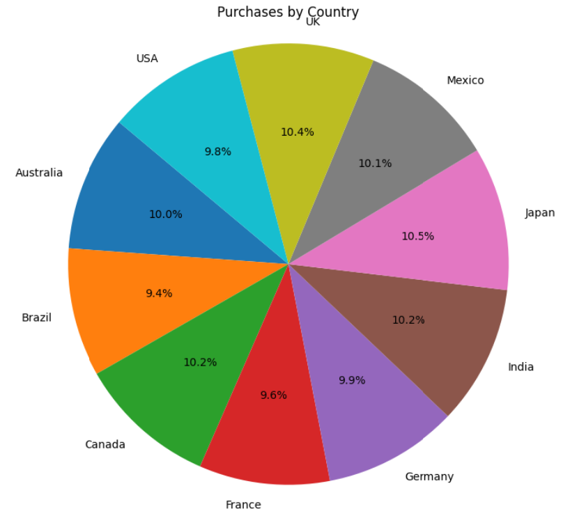
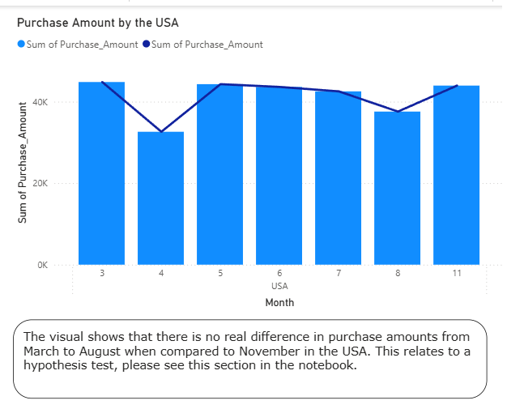
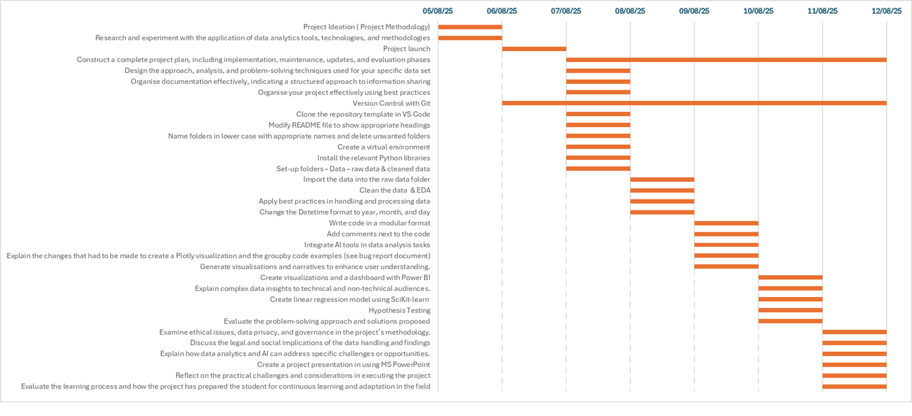
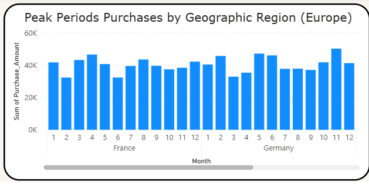
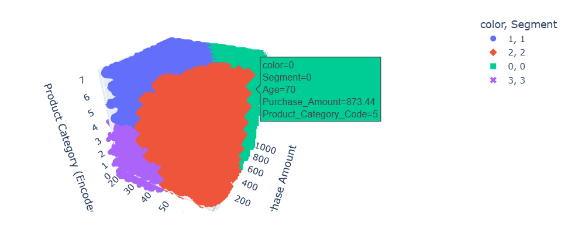
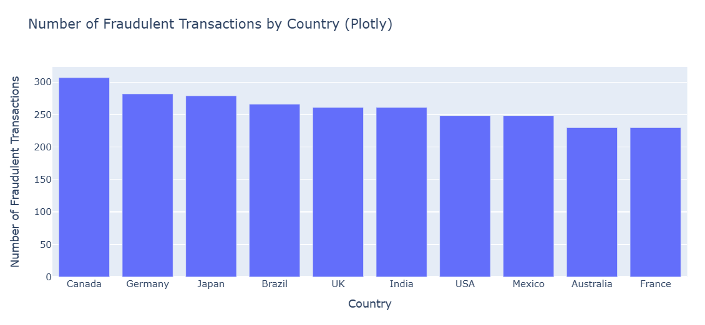
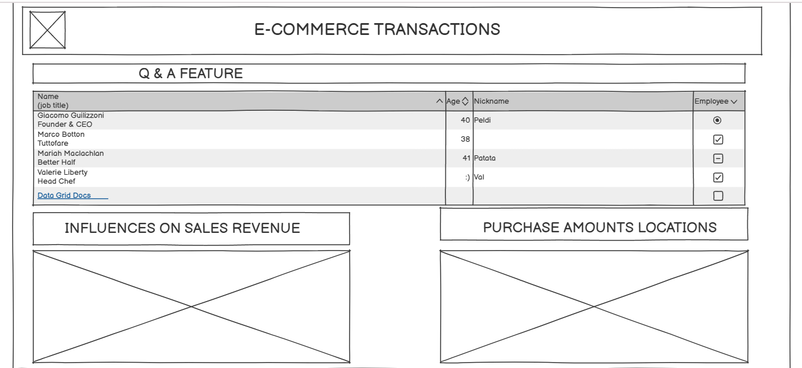
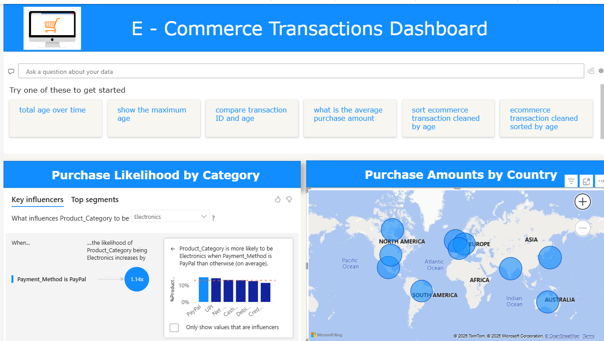

# 

# Introduction

**Project Global Store** is based on the data experimental methodology, where I will be carrying out analysis, identifying trends, and showing visualisations that reflect what is within the data. The scope of this project will focus on the business requirements, hypothesis testing, project plan, and the analysis techniques used.

## Dataset Content

* Describe your dataset. Choose a dataset of reasonable size to avoid exceeding the repository's maximum size of 100Gb.
The dataset was obtained from the Kaggle website [Explore the E-Commerce Transactions Dataset](https://www.kaggle.com/datasets/smayanj/e-commerce-transactions-dataset). It consists of 50,000 rows and 8 columns, but will be reduced to 10,000 rows and then have 11 columns after the feature engineering process. The dataset has been reduced in size to minimize the impact on the computer's resources. There will be further modifications to the dataset due to the insights to be generated by adding additional columns for year, month, and day. Also, the dataset will be balanced in order to gain insights into fraud that the business experiences.

## Introduction to the business
The business trades worldwide online, selling goods ranging from clothing, electronics and books. The business accepts a variety of payment methods, and purchase amounts range from £3.76 to £752.82. The business generates a fairly even amount of sales revenue from various countries, which may reflect that overseas markets for its products are quite competitive. 

The business is likely to use the 5Ps to determine its marketing strategy. These are:
- Product – description of the product
- Price – pricing strategy to be used, which will range from price skimming to market-led pricing. This will aid customer segmentation based on the amount spent as one factor.
- Place  - Where the item will be available from, this will be direct from the store.
- People – The skilled staff within the business providing customer service.
- Promotion – The business is likely to use email marketing campaigns to sell products, inform customers about sales and promotions. Also, to generate data about the number of visits to the online store website, clicks, and the success of marketing campaigns.

Targeting different countries at different times of the year will be key to generating more sales revenue and provides an insight into the business's strategy. The table below provides an insight into celebrations worldwide for January.

| Month      | Japan                          | USA                          | Canada                    | UK                           | France                          | Germany                        | India                                | Mexico                                  |
|------------|--------------------------------|-------------------------------|---------------------------|------------------------------|----------------------------------|----------------------------------|----------------------------------------|------------------------------------------|
| January    | Shōgatsu (New Year)            | New Year's Day, MLK Day       | New Year's Day            | New Year's Day, Burns Night | Jour de l’An, Epiphany          | Neujahr, Three Kings Day        | Makar Sankranti, Pongal, Republic Day  | Año Nuevo                               |

## Business Requirements
* Describe your business requirements
•	To see which products sell the most at different times of the year in different geographic regions.

**Objective:** To identify the peak periods when different products sell in different geographic regions.

**Value:** This aids cash flow so the business does not purchase more than it needs.

•	To identify the different market segments and focus marketing on them to improve sales and customer satisfaction.

**Objective:** To identify and understand the different market segments and their purchasing habits.

**Value:** Marketing campaigns, from research to promotion, can be tailored to different segments to stay up-to-date with changing tastes and preferences. This will help to maximise sales revenue.

•	Detect fraud to reduce the loss to the business and to improve customer trust.

**Objective:** The cost of online e-commerce fraud is over  £35 million, and a business needs to reduce this loss.

**Value:** The business can reduce its revenue losses by flagging up transactions that are not ‘ordinary’ by tightening and improving its payment acceptance procedures.  This will benefit the business's cash flow.

## Hypothesis and  validation
* Below is a list of hypotheses which have been applied to the DataFrame contents. Chi-square test and Welch's t-test have been used for hypothesis testing.

1.	Is the total purchase amount higher between March and August compared to November in the USA?

2.	Does the business prefer Credit Card payments over Cash on Delivery (COD)?

3.	Does the Sports category generate more sales than the Home & Kitchen category?

## Project Plan

The objective of the project was to understand how the business is performing across the world. To know where and when the business generates the most sales revenue and to suggest ways in which it can improve is one of the drivers for this project. Another aspect is the extent of fraud that this business is experiencing, and suggestions can be made to the owners to safeguard against this.

The Gantt chart shows the various stages of the project, given the time frame.

The various libraries required for the project were installed to begin with. The data was managed by loading the CSV file from the Kaggle website into a folder, raw_data,  in the Git Hub repository. Then loaded into a  Jupyter Notebook using Python code. The file was then reduced in size to 10K rows, and then the date was divided into year, month, and day. The file was then checked for null values and empty rows using the appropriate Python code. The data was then saved using a new file name to avoid any confusion and overwriting of the file. I used different variable names for each analysis and visualisation so as not to affect the updated CSV file.

* Methodologies Used
To understand the given numerical data and identify patterns and trends with the appropriate library outlined in the table above. When taking the time and resources into account, I needed a flexible methodology that would cover each task and produce findings that would be accessible to all stakeholders. I chose the  **OSEMN** framework for the project for this reason. Please see the table below.

| Stage       | Application                                  |
|--------------|-------------------------------------------|
|**O**btain       | Python				 |
| **S**crub    | Pandas                    			          |
| **E**xplore      |Matplotlib &  Seaborn                           |
| **M**odel         | Scit-learn                                                   |
| **I**nterpret    | Power BI                                                      |

## The rationale to map the business requirements to the Data Visualisations
* List your business requirements and a rationale to map them to the Data Visualisations
- To see which products sell the most at different times of the year in different geographic regions. This example focuses on Europe.

#### To identify the different market segments and focus marketing on them to improve sales and customer satisfaction. 

#### Detect fraud to reduce the loss to the business and to improve customer trust.

## Analysis Techniques Used

The data analysis methods used were as follows:
-Pandas
-Numpy
-Scit-learn

The downside is that they do not uncover deeper trends and patterns; visual tools could be used to identify these trends to understand data distribution and relationships.

I based the data analysis techniques around the business requirements and would use **groupby** Python code to focus more on a particular aspect of the dataset in order to generate the various insights. Then I would use Python code related to a given business objective, like detecting fraud. Then perform hypothesis testing to ascertain the likelihood of a given occurrence. Then I would generate a visual to give both clarity and insight.

The data did limit me; if I had data on GDP and inflation for each country, then this would have provided greater insights. This would have had an impact on disposable income and, therefore, demand for the goods on sale.

I used generative AI to test the code that I input, to generate code for plots, and to detect fraud.

## Ethical considerations

The data was obtained from the Kaggle website and is fictitious. However, there were names in the dataset, but in the real world, they would be encrypted before processing. In terms of data retention, the data was stored in an appropriately named folder and given a file name, and was stored safely.
In terms of bias and fairness, the data might be biased towards certain geographic regions or customer segments. The data was balanced for the purpose of fraud detection.
In terms of governance, the dataset complies with usage licensing, and no terms were violated. All data cleaning and modelling are documented in Git/GitHub.

There were only user IDs and no names and addresses, which preserved customers' privacy of which is in keeping with GDPR within Europe. The business would have to adhere to laws and regulations governing the various parts of the world where it trades. To address bias, the data was balanced when dealing with fraud detection, and again, no names were stated when data and visuals were outputted. 

Overcoming any legal or societal issues was addressed by adhering to legislation and regulations worldwide. As mentioned above, like GDPR. Also, obtaining the consent of customers when they create an online account. To avoid bias, the dataset was balanced when using a K-MEANS algorithm. The data reflects a wide range of customers, and this is why it's important to balance the dataset to provide a clearer insight. The policies on data handling would be made available and maintained. 

## Dashboard Design

The dashboard was designed using Balsamiq to create a wireframe to give me an idea of what the finished dashboard layout would look like. This can be seen below:

#### I originally was going to have a matrix and a slicer feature that Power BI  provides, but I had to remove them because they affected the functionality of the Key Influencers feature.

#### The dashboard had two pages, one was concerned with peak purchasing periods, and the main dashboard page had the following features:

* Q & A feature – this would enable the user to drill down into the data. This would be suitable for a non-technical to a technical user. They can ask any questions about the data, primarily because it is AI-driven.

* Key Influences feature – This feature provides information about customers and their likelihood of making purchases based on the dataset.

* Global feature – This identifies which countries around the world make purchases.

#### I have used different visuals to suit a non-technical audience, like pie and bar charts. Also, I have described the visuals and insights using jargon-free language. For a more technical audience, see notebooks, I have used technical terms and language, and described the code that I used to obtain data relating to a certain insight.

## Unfixed Bugs
* I encounterd functionality issues on the Power BI dashboard with Key Influences feature, so I had to remove it despite trying other variables from the dataset. I also encountered issues with links and getting them to work, so I looked at the syntax and realised I had to use a forward slash. I also used Copilot and ChatGPT to gain insights and test code and to solve errors concerned with attributes.

* I recognised that I have spend more time in understand the code to plot the various visuals whether it be Matplolib, Plotly or Seaborn. This is so I will understand the order in which to code the visual.

## Development Roadmap
* What challenges did you face, and what strategies were used to overcome these challenges?
The challenges I faced were ensuring the visuals were correct to show the right insight, especially the 3D Plotly visual.I used Copilot to begin with and then ChatGPT, but I changed the variables to give me a clear and informative visual.
* I plan to expand my knowledge on Python and Power BI by committing to various online courses and reinforcing this new knowledge by exploring new datasets.

## Main Data Analysis Libraries

* Here you should list the libraries you used in the project and provide an example(s) of how you used these libraries.

| Library       | Purpose                                              |
| ------------- | ----------------------------------------------------- |
| Pandas        | Data cleaning, manipulation, and analysis           |
| Matplotlib    | Plotting basic visuals                                |
| Seaborn       | Statistical plotting                                  |
| Numpy         | Numerical applications in Python                        |
| Scikit-learn  | Machine Learning & Data Analysis                        |
| Plotly        | Interactive visualisations                            |

## Credits 

* Pixabay Royalty Free image – e-commerce logo
https://pixabay.com/illustrations/ecommerce-online-shopping-e-commerce-1992280/

* Pandas Documentation - Groupby 
 https://pandas.pydata.org/pandas-docs/stable/reference/api/pandas.DataFrame.groupby.html

* Pandas Documentation - Datetime
https://pandas.pydata.org/pandas-docs/stable/reference/api/pandas.to_datetime.html
The code was also automatically generated within a Jupyter notebook after inputting the first line.

* Online Fraud reference
https://www.demandsage.com/ecommerce-fraud-statistics/

* Power BI - ULTIMATE Power BI Tutorial Beginner to Pro Course (2024)
https://www.youtube.com/watch?v=Dk25lwdTKow&t=2256s

* Make a Power BI Dashboard in 15 Minutes!
https://www.youtube.com/watch?v=NISsW-bVAwU

* Code Academy - Markdown Tables
https://www.codecademy.com/resources/docs/markdown/tables

* Markdown Live Preview - https://markdownlivepreview.com/

* Balsamiq Wireframe - https://balsamiq.cloud/#

* World Celebration Days – Copilot

* Kaggle Website - https://www.kaggle.com/datasets/smayanj/e-commerce-transactions-dataset

## Acknowledgements (optional)
* Thank the people who provided support through this project.

* Emma Lamont - Code Institute
* Spencer -  Code Institute
* Niel McEwan - Code Institute
